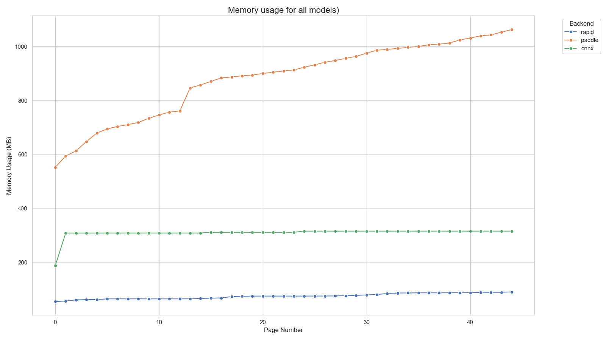
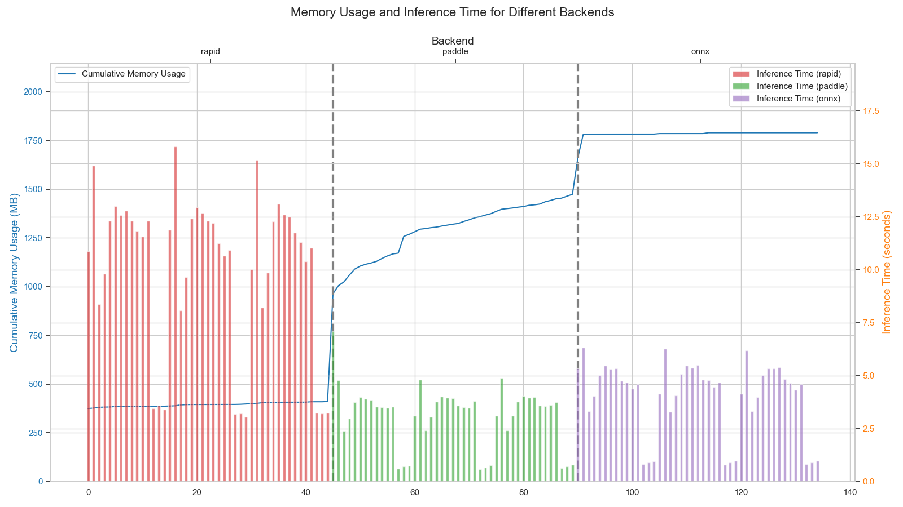
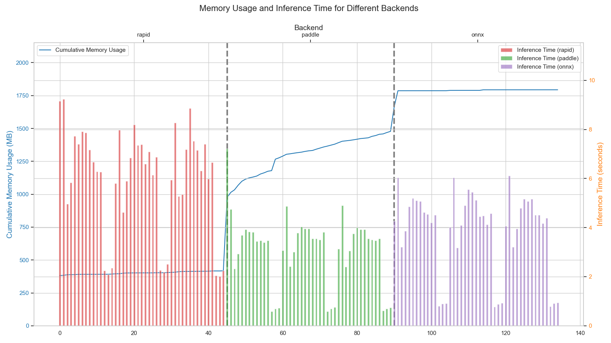

# PaddleOCR Tests

The goal of this repo is explore the potential of PaddleOCR models with ONNX Runtime. The idea is to convert the PaddleOCR models to ONNX format and run them with ONNX Runtime. Given the known memory leakages in PaddleOCR, we will also explore the performance of the models in terms of memory usage and speed.

## Setup

#### [on Mac] For paddlepaddle:

```bash
uv pip install paddlepaddle==0.0.0 -f https://www.paddlepaddle.org.cn/whl/mac/cpu/develop.html
```

#### Download Paddle Models

```bash
source scripts/download_models.sh
```

#### Convert Paddle Models to ONNX

```bash
source scripts/convert_models.sh
```

## Models
[Model List](https://github.com/PaddlePaddle/PaddleOCR/blob/release/2.6/doc/doc_en/models_list_en.md)

### Detection Model
- [ml_PP-OCRv3_det](https://paddleocr.bj.bcebos.com/PP-OCRv3/multilingual/Multilingual_PP-OCRv3_det_infer.tar)
- [ch_PP-OCRv3_det](https://paddleocr.bj.bcebos.com/PP-OCRv3/chinese/ch_PP-OCRv3_det_infer.tar)

### Recognition Model
- [latin_PP-OCRv3_rec](https://paddleocr.bj.bcebos.com/PP-OCRv3/multilingual/latin_PP-OCRv3_rec_infer.tar) | [ppocr/utils/dict/latin_dict.txt](https://raw.githubusercontent.com/PaddlePaddle/PaddleOCR/refs/heads/main/ppocr/utils/dict/latin_dict.txt)
- [ch_PP-OCRv3_rec	](https://paddleocr.bj.bcebos.com/PP-OCRv3/chinese/ch_PP-OCRv3_rec_infer.tar) | [ppocr/utils/ppocr_keys_v1.txt](https://raw.githubusercontent.com/PaddlePaddle/PaddleOCR/release/2.6/ppocr/utils/ppocr_keys_v1.txt)

### Angle Classification Model
- [ch_ppocr_mobile_v2.0_cls](https://paddleocr.bj.bcebos.com/dygraph_v2.0/ch/ch_ppocr_mobile_v2.0_cls_infer.tar)

## Results
### Memory Usage
#### Mac M1
|  |  |
| ----------------------------------------------------------------------- | --------------------------------------------------------------------- |

#### CPU (n_cpu=1 ...not tue paddleocr config doesn't quite work as intended)
|  |  |
| ----------------------------------------------------------------------- | --------------------------------------------------------------------- |

#### CPU (n_cpu=12)
|  |  |
| ----------------------------------------------------------------------- | ---------------------------------------------------------------------- |
